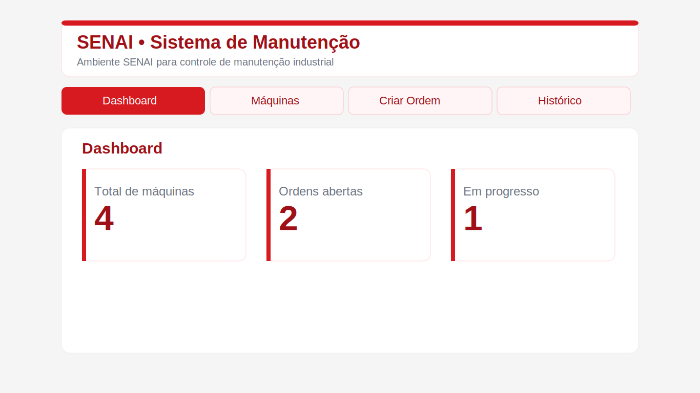

# Sistema de Manutenção de Máquinas — SENAI


CMMS para contexto industrial/manufatura com identidade visual SENAI. Backend HTTP puro em Node.js, banco SQLite embutido e SPA sem frameworks no frontend.

## Preview


## Arquitetura
- **Backend** — API REST em `backend/src/server.js`; Node.js nativo (sem Express), porta `3001`
- **Banco** — SQLite via `better-sqlite3`; schema em `backend/sql/schema.sql`; `backend/data/senai.db` gerado em runtime
- **Frontend** — SPA em `frontend/{index.html,main.js,styles.css}`; servida na porta `5173`

## Endpoints

| Método | Rota | Corpo / Nota |
|--------|------|-------------|
| `GET` | `/health` | — |
| `GET` | `/machines` | — |
| `GET` | `/machines/:id` | — |
| `POST` | `/machines` | `name`, `sector`, `status` |
| `PUT` | `/machines/:id` | campos parciais |
| `DELETE` | `/machines/:id` | HTTP 409 se houver ordens ativas |
| `GET` | `/orders` | inclui `machine_name` via JOIN |
| `POST` | `/orders` | `machine_id`, `description`, `priority`, `status` |
| `PUT` | `/orders/:id/status` | `status` |
| `DELETE` | `/orders/:id` | — |
| `GET` | `/reports/orders-machines` | relatório JOIN |
| `GET` | `/reports/summary` | contagem agrupada por status |

> Criação de ordem ativa altera automaticamente o `status` da máquina para `maintenance`; ao concluir a última ordem ativa, a máquina retorna para `operational`.

## Schema SQL

```sql
CREATE TABLE machines (
  id     INTEGER PRIMARY KEY AUTOINCREMENT,
  name   TEXT NOT NULL,
  sector TEXT NOT NULL,
  status TEXT NOT NULL CHECK (status IN ('operational','maintenance','offline'))
);

CREATE TABLE maintenance_orders (
  id         INTEGER PRIMARY KEY AUTOINCREMENT,
  machine_id INTEGER NOT NULL REFERENCES machines(id),
  description TEXT NOT NULL,
  status     TEXT NOT NULL CHECK (status IN ('open','in_progress','completed')) DEFAULT 'open',
  priority   TEXT NOT NULL CHECK (priority IN ('low','medium','high','critical'))  DEFAULT 'medium',
  created_at TEXT NOT NULL DEFAULT CURRENT_TIMESTAMP
);
```

## Executar

```bash
# terminal 1
npm run dev:backend   # http://localhost:3001

# terminal 2
npm run dev:frontend  # http://localhost:5173
```

## Testes

```bash
npm test
```

14 casos com o runner nativo do Node.js — sem dependências de teste. Cobre o CRUD completo de máquinas e ordens, sincronismo automático de status, bloqueio de exclusão com ordens ativas, prioridade e o endpoint `/reports/summary`; além da estrutura HTML e CSS do frontend (responsividade, filtros e badges de prioridade).
